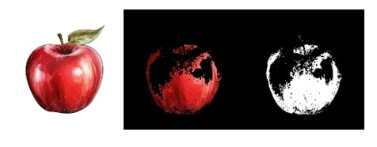

# **Image Processing using OpenCV**  

This repository contains various image processing scripts using OpenCV, covering techniques such as color detection, image pyramids, smoothing, edge detection, and face detection.  

---

## **Project Structure**  

```
├── images/               # Folder containing input images
│   ├── 1.jpg
│   ├── 2.jpg
│   ├── 3.jpg
│   ├── 4.jpg
│   ├── 5.jpg
├── color_detection.py     # Detects a specific color in an image
├── image_pyramid.py       # Generates an image pyramid
├── image_smoothing.py     # Applies Gaussian & Median blur
├── edge_detection.py      # Performs Sobel & Canny edge detection
├── face_detection.py      # Detects faces using Haar Cascade
└── README.md              # Documentation file
```

---

## **Script Details**  

### **1. Color Detection (`color_detection.py`)**  
Detects a specific color in an image using HSV color space and mask filtering.  

### **2. Image Pyramid (`image_pyramid.py`)**  
Creates a Gaussian image pyramid with multiple downscaled versions of an image.  

### **3. Image Smoothing (`image_smoothing.py`)**  
Applies Gaussian blur and median blur to remove noise from images.  

### **4. Edge Detection (`edge_detection.py`)**  
Uses Sobel and Canny edge detection techniques to highlight object edges.  

### **5. Face Detection (`face_detection.py`)**  
Detects human faces in an image using OpenCV's Haar cascade classifier.  

---

## **Example Output**  

### **Color Detection**


### **Edge Detection**


### **Image Pyramid**


### **Image Smoothing**


### **Face Detection**

